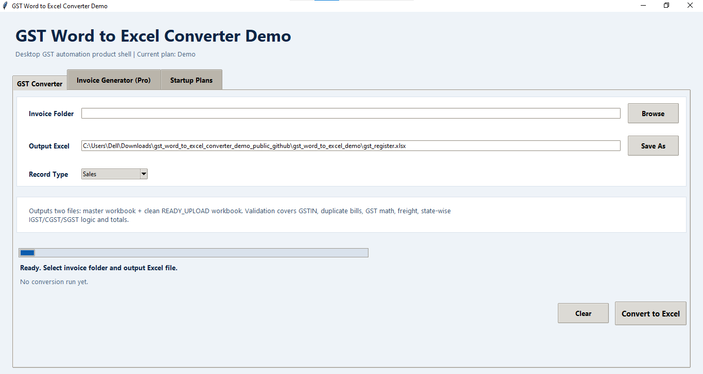

# GST Word to Excel Converter

A Python desktop application that automates GST invoice processing and accountant-style Excel register generation.

## Features

### GST Invoice Extraction
- Extracts data from Word invoices
- Extracts data from PDF invoices
- Reads GSTIN, Invoice No, Date, HSN and Tax amounts

### Excel Register Generation
- Accountant-style GST workbook
- Monthly sheets
- Summary sheet
- GSTIN master sheet
- Validation and audit reports

### Invoice Generation
- GST-compliant Word invoice generation
- CGST/SGST support
- IGST support
- Automatic tax calculations
## How To Use
- First you have to create a new folder , name it whatever you want....this will be the folder where your gst extract will be saved.
- Then you have to upload your invoices folder.
- Then you have to click on save as and select the folder which u have created before.
- Then click on convert to excel....your gst extract's master workbook and a ready to upload file will be saved in the folder which u have created
- if u have entered something wrong and have to clear all the uploaded data click on clear button.

## Screenshot

## Technologies

- Python
- Tkinter
- OpenPyXL
- Python-Docx
- PDFPlumber
- SQLite

## Download

Download the latest executable from the Releases section.

No Python installation required.

## Project Purpose

This project was built to learn:

- Desktop software development
- Business automation
- GST processing
- Excel automation
- Invoice generation

## Note

This is a public demonstration version.

No real customer information, invoices, GST records, or business data are included.

This project was developed as a learning project with AI assistance.

## Author

Parth Paliwal
Grade 9 Student
Python Learner
